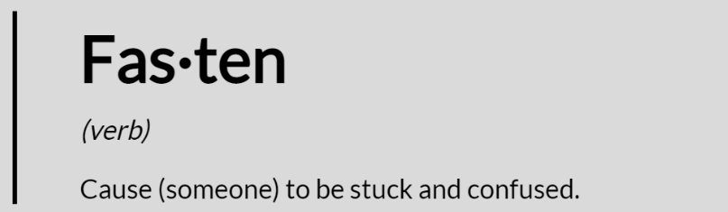

---
# Feel free to add content and custom Front Matter to this file.
# To modify the layout, see https://jekyllrb.com/docs/themes/#overriding-theme-defaults

layout: home
---

## Introduction

This blog describes some of the bugs I encountered while developing my game Taiga in Rust using WGPU.

There is (at the time of me writing this blog) very little content on the internet (apart from this great [tutorial](https://sotrh.github.io/learn-wgpu/) to start with and a [subreddit](https://www.reddit.com/r/rust_gamedev/) for Rust game development) for WGPU developers in Rust, and this blog was created to share some knowledge and experience.

If you're here, you might be interested in the library [wgsl_preprocessor](https://crates.io/crates/wgsl_preprocessor) that I wrote and published which makes working with WGSL shaders in WGPU way easier.

Feel free to PR this project if you spot any mistakes or have some additional knowledge to share that you see fit for this blog.
